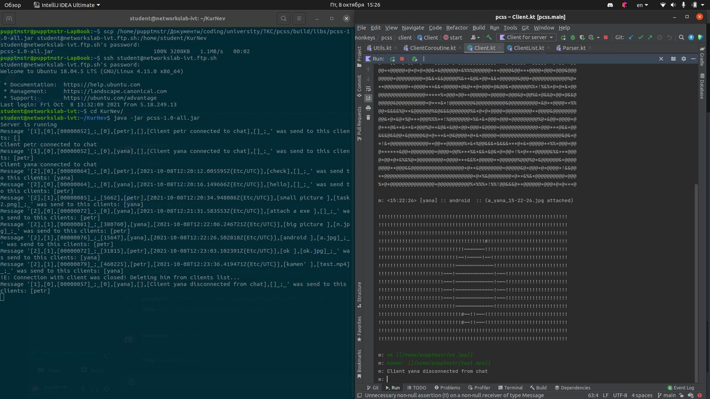

# PCSP (positive content sharing protocol)
Данный протокол создавался для общения и передачи позитивного контента между участниками-клиентами. 
## Формат передачи данных
Назовем одно сообщение с клиента на сервер или в обратную сторону - Message'ом. Message состоит из Header'а 
фиксированной длины 20 байт для того, чтобы далее из потока корректно считывать данные, 
Data'ы, и массива байтов (файла), если он прикреплен. Полный формат сообщения:

`[messageType],[isFileAttached],[dataSize]_;_[fileSize],[senderName],[time],[messageText],[fileName]_;_FileByteArray`
### Header
`[messageType],[isFileAttached],[dataSize]_;`

Где:
1) messageType - тип сообщения. Может принимать значения 0(Login), 1(Special), 2(Message).
   1) Login - передается в самом начале при установлении соединения. Используется только для регистрации пользователя в чате
   2) Special - зарезервированный тип для возможного расширения возможностей протокола (отправка управляющих сообщений)
   3) Message - самый часто отправляемый тип. Простое собщение в чате
2) isFileAttached - булевая переменная (0-false, 1-true), указывающая на то, будет ли прикреплен файл к сообщению (писать сюда надо цифру)
3) dataSize - 8-разрядный размер отправляемой data в байтах. Если размер всего 35 байт, то здесь должно записываться 00000035

### Data
`_[fileSize],[senderName],[time],[messageText],[fileName]_;`

Где:
1) fileSize - размер файла в байтах
2) senderName - имя отправителя (которое было указано при логине)
3) time - время отправки сообщения (проставляется сервером) в формате 2021-10-01T12:28:16.976915Z{Etc/UTC} или 2021-10-01T15:28:16.976915+03:00{Europe/Moscow}. Клиент должен регулировать время на свое самостоятельно.
4) messageText - текст сообщения. Необходимо заменять символы '[' и ']' на '%+<+$' и '%+>+$' соответственно.
5) fileName - имя файла, если он прикреплен

## Порядок общения и установления связи
### Логин(первое подключение) 
При первом подключении клиент отправляет на сервер сообщение с messageType 0(Login) в хэдэре, а в senderName записывается
желаемый никнейм.
Далее с сервера приходит ответ о том занят этот никнейм или нет. Если занят - через некоторое время сервер автоматически 
закроет сокет(клиент будет об этом уведомлен). Если нет - можно общаться от этого имени.

### Пересылка файлов
Если к сообщению был прикреплен файл, то необходимо проставить:
1) isFileAttached=1
2) fileSize - проставить размер файла в байтах
3) fileName = имени прикрепленного файла (будет использоваться, чтобы под этим же именем сохранить файл у клиентов)
4) Поток байтов файла записать в конец мэссэджа, предварительно закодировав весь поток в Base64
(это нужно для того, чтобы все байты успешно были пересланы другим клиентам и не были испорчены по дороге)

# PCSS (positive content sharing system)

PCSS - консольный мессенджер для обмена позитивным контентом, сделанный на базе протокола PCSP.

Подключение инициируется клиентом c указанием желаемого никнейма. Если подключение успешно, 
клиент устанавливает соединение с сервером через сокет и далее в течение подключения может общаться
с другими подключенными клиентами. Для общения используется общий протокол, используемый для 
отправки сообщений обеими сторонами. Сообщение может не содержать или содержать только одно вложение, 
которое предается в конце сообщения в формате [[filepath]]. Клиент может разорвать соединение с помощью 
ключевого слова 'q', сервер закрывает соединение с данным клиетном. При закрытии сервера все клиенты об 
этом уведомляются и подключения закрываются. Также при первом подключении клиент уведомляется о количестве человек
в чате на данный момент, другие клиенты получаю сообщение о том, что подключился новый клиент, при выходе из чата
все участники общения также об этом оповещаются. 
Клиенты могут прикреплять только медиафайлы. При попытке отправить, например, исполняемый файл, сообщение клиентам
отправится, но прикреплено ничего не будет. С каждым сообщением в чате отображается милый ASCII-котик, а если было 
прикреплено сообщение с картинкой, то все клиенты вместо ASCII-котика увидят ASCII отображение прикрепленной
картинки. 
При первом подключении в той же папке, где лежал запускаемый jar-файл, создается папка для сохранения скачанного 
контента с названием 'PCSS downloads', в которую в последствии загружаются все прикрепленные в чате файлы.

# Список литературы
[Скачивание файла](https://www.tutorialkart.com/kotlin/kotlin-create-file/) \
[Зонирование времени в JVM](https://www.baeldung.com/java-zone-offset) \
[Обсуждение на тему правильной передачи двоичной информации через сокеты](https://coderoad.ru/1536054/%D0%9A%D0%B0%D0%BA-%D0%BF%D1%80%D0%B5%D0%BE%D0%B1%D1%80%D0%B0%D0%B7%D0%BE%D0%B2%D0%B0%D1%82%D1%8C-%D0%B1%D0%B0%D0%B9%D1%82%D0%BE%D0%B2%D1%8B%D0%B9-%D0%BC%D0%B0%D1%81%D1%81%D0%B8%D0%B2-%D0%B2-%D1%81%D1%82%D1%80%D0%BE%D0%BA%D1%83-%D0%B8-%D0%BD%D0%B0%D0%BE%D0%B1%D0%BE%D1%80%D0%BE%D1%82) \

# Пример работы в реальной сети

## Сообщения на сервере и диалоговое окно клиента 1

## Диалоговое окно клиента 2

